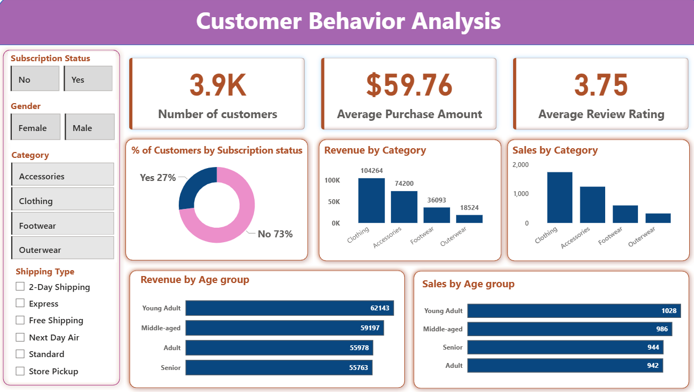

# Customer_Shopping_Insights
Data analytics project exploring customer purchasing patterns, subscriptions, and product performance across 3,900 transactions.
# Customer Shopping Behavior Analysis

## Overview

This project analyzes customer shopping behavior using transactional data to uncover spending patterns, customer segments, product preferences, and subscription trends. The analysis combines Python for data preparation, SQL for business analysis, and Power BI for interactive data visualization, delivering actionable business insights.

---

## Dataset

The dataset contains customer demographic information, purchase details, shopping behavior metrics, and subscription status.

**Key Features:**

* Customer Demographics (Age, Gender, Location)
* Purchase Information (Products, Categories, Amount Spent)
* Shopping Behavior (Discounts, Purchase Frequency, Ratings)
* Subscription Status
* Seasonal and Shipping Preferences

---

## Tools & Technologies

### Programming & Analysis

* Python

  * Pandas
  * NumPy
  * Matplotlib
  * Seaborn

### Database

* PostgreSQL / MySQL / SQL Server
* SQL

### Visualization

* Power BI

### Documentation & Presentation

* Microsoft PowerPoint
* Gamma AI

---

## Project Workflow

### 1. Data Loading & Exploration

* Imported dataset using Pandas
* Performed initial data inspection
* Generated descriptive statistics
* Identified missing values and data quality issues

### 2. Data Cleaning & Preparation

* Handled missing values
* Standardized column names
* Removed redundant fields
* Created derived features for analysis
* Validated data consistency

### 3. Exploratory Data Analysis (EDA)

* Customer demographics analysis
* Spending behavior analysis
* Product category analysis
* Purchase frequency analysis
* Subscription behavior analysis

### 4. SQL Analysis

Performed business-focused analysis using SQL queries, including:

* Revenue by customer segments
* Top-performing products
* Customer segmentation
* Subscription impact analysis
* Discount and promotion effectiveness
* Revenue trends across demographics

### 5. Dashboard Development

Built an interactive Power BI dashboard featuring:

* Revenue Overview
* Customer Demographics
* Product Performance
* Subscription Analysis
* Customer Segmentation
* Purchasing Trends

### 6. Reporting & Presentation

* Created a detailed business report summarizing findings
* Developed a professional presentation using Gamma AI
* Provided actionable business recommendations

---

## Dashboard

**Key KPIs**

* Total Revenue
* Average Purchase Value
* Customer Segments
* Subscription Conversion Rate
* Top-Selling Products
* Revenue by Category

## Dashboard Preview

 

## Results & Insights

Key findings from the analysis include:

* Identification of high-value customer segments
* Understanding of subscription-driven revenue patterns
* Discovery of top-performing products and categories
* Analysis of discount effectiveness on purchasing behavior
* Insights into customer retention and loyalty trends

---

## Repository Structure

```text
├── data/
├── notebooks/
├── sql/
├── powerbi/
├── reports/
├── presentation/
├── images/
└── README.md
```

---

## How to Run

### 1. Clone the Repository

```bash
git clone https://github.com/your-username/customer-shopping-behavior-analysis.git
```

### 2. Install Dependencies

```bash
pip install -r requirements.txt
```

### 3. Run Python Analysis

```bash
python analysis.py
```

### 4. Execute SQL Queries

* Import cleaned data into PostgreSQL, MySQL, or SQL Server
* Run SQL scripts from the `sql/` folder

### 5. Open Power BI Dashboard

* Open the `.pbix` file in Power BI Desktop

---

## Business Recommendations

* Strengthen customer loyalty programs
* Increase subscription adoption through targeted campaigns
* Promote top-rated products more effectively
* Optimize discount strategies to improve profitability
* Focus marketing efforts on high-value customer segments

---

## Author

**Ranjitha K**

Data Analytics Project showcasing end-to-end analytics using Python, SQL, Power BI, and business reporting.
